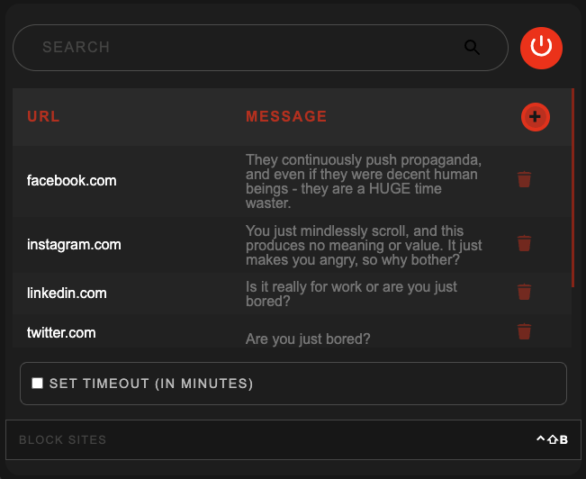

# Blocklist

A lightweight, private, no nonesense, local website blocker.

## Features:

- **Quick toggle** - Enable via popup or shortcut (default: Ctrl-Shift-B)
- **Auto refresh** - Automatically reloads pages on state changes
- **Time-based blocking** - Optionally disable the blocker after a specified timeout period
- **YouTube Minimal Mode** - Strips YouTube to search bar with collapsible Watch Later/History tabs
- **Instagram Minimal Mode** - Redirects Instagram to DMs only

## FAQ:

- Quick toggle keyboard shortcut doesn't disable - Yep. That's by design. I wanted to make it harder to waste time.

---

## TODO:

- [ ] Per URL blocking
- [ ] Connect to a pool of articles (or actually useful links) that I might wanna read instead and suggest them
- [ ] Release to Chrome Web Store
